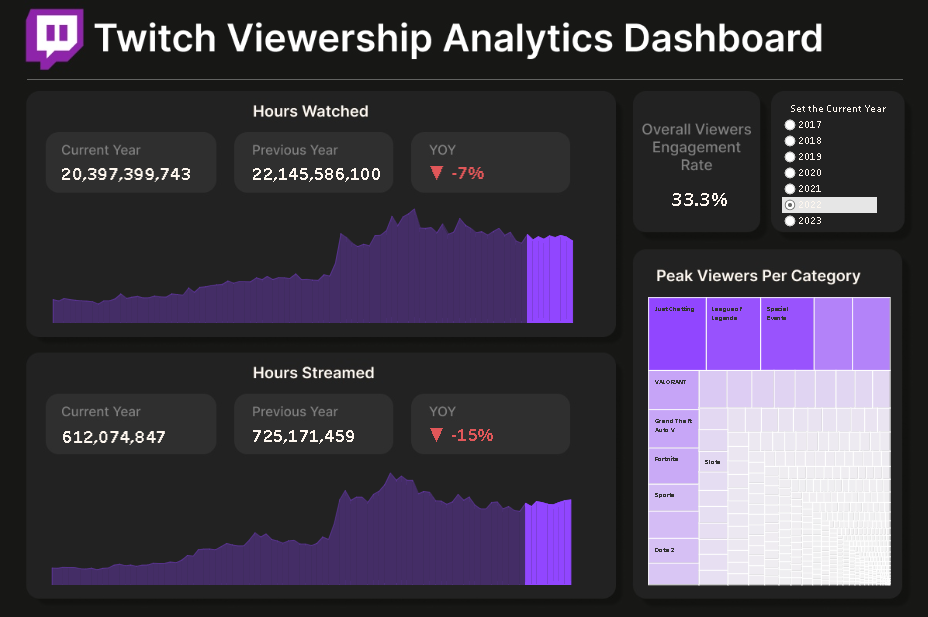

<!-- PROJECT LOGO -->
 

  

  <h3 align="center">Twitch Viewership Analytics Dashboard</h3>

  

    Navigating Twitch Viewer Engagement!
     
     
     
  

<!-- ABOUT THE PROJECT -->
## About The Project

 

 

This project revolves around the creation of a comprehensive analytics dashboard for Twitch, a popular live game streaming platform. Leveraging a diverse dataset encompassing metrics such as 'Hours Watched', 'Hours Streamed', 'Peaked Viewers', and more across various games and categories, this dashboard aims to provide insights into viewership patterns, engagement metric, and trends over time. The dashboard's visualizations and data exploration can help platform administrators, and analysts, including content creators to gain actionable insights, optimize content strategies, and make informed decisions based on Key Performance Indicators (KPIs) derived from Twitch's streaming data.

### Built With

* 
* 
* 

<!-- ACKNOWLEDGMENTS -->

## Resources

* [Twitch Dataset](https://www.kaggle.com/datasets/rankirsh/evolution-of-top-games-on-twitch)
* [Visit and Interact with the Dashboard](https://public.tableau.com/app/profile/jazley.manguino/viz/TwitchKingofLiveGameStreaming/MainDashboard)

